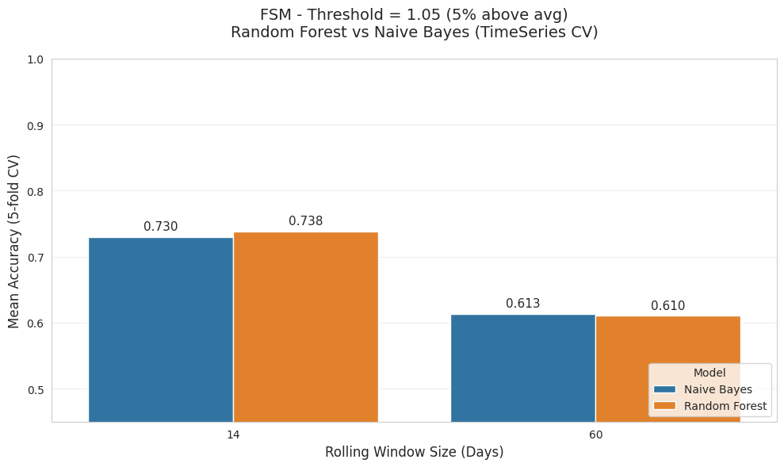
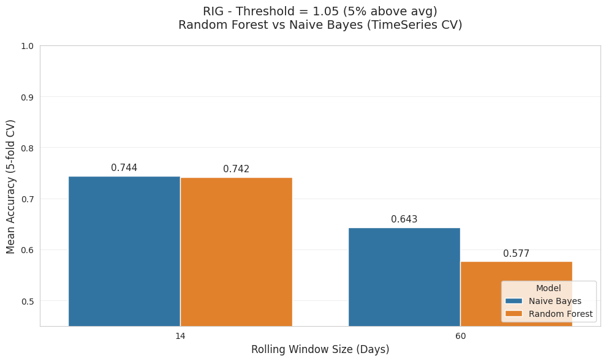

# Stock Price Trend Prediction

**A systematic time-series machine learning project to predict short-term stock price trends using rolling statistical features.**

## Technologies
 


## Objective

Build and evaluate models to classify whether a stock will experience a significant upward price movement (2% or 5% above its recent average) on the next trading day, using only **price skewness** and **relative volume** derived from rolling windows (14 and 60 days).

This project emphasizes **time-series validation**, systematic experimentation, and clear reporting on challenging financial data.

## Key Results (TimeSeriesSplit 5-fold CV)

- **Best overall performance**: **74.40%** mean accuracy — achieved by **Naive Bayes** using a **14-day rolling window** and **5% return threshold**
- Short-term (14-day) windows consistently outperformed 60-day windows
- Stronger trends (5% threshold) produced significantly better results than 2% threshold
- Full detailed comparison available in [`reports/model_summary_timeseries_cv.csv`](reports/model_summary_timeseries_cv.csv)

### **Colab Notebook Link**

## Colab Notebook

[](https://colab.research.google.com/drive/13mDccMvxfU-q6eJRyUqPKNgLm5Y_GNrd?usp=sharing)

## Project Structure
```bash
stock-price-trend-prediction/
├── data/raw/                    # Raw data (auto-downloaded via yfinance)
├── images/                      # Generated result visualizations
├── models/                      # Saved models (optional)
├── notebooks/
│   └── stock_price_trend_analysis.ipynb    # Main analysis notebook
├── reports/                     # CSV summaries and text reports
├── src/
│   └── stock_analysis.py        # Feature engineering & modeling code
├── requirements.txt
├── README.md
└── .gitignore
```

## Methodology

- **Features**: Skewness of normalized prices + relative volume over rolling windows
- **Target**: Binary (1 = next day return ≥ threshold, 0 = otherwise)
- **Models**: Random Forest & Gaussian Naive Bayes
- **Validation**: `TimeSeriesSplit` (5-fold expanding window CV)
- **Experiment Grid**: 2 stocks × 2 windows × 2 thresholds

## Results Visualizations

**FSM - 5% Threshold**  


**RIG - 5% Threshold**  


*(Additional charts for other combinations are also saved in `reports/figures/`)*

## How to Reproduce

1. Clone the repo:
   ```bash
   git clone https://github.com/d-toups/stock-price-trend-prediction.git
   cd stock-price-trend-prediction
   ```
2. Install dependencies:
   ```bash
   pip install -r requirements.txt
   ```
3. Open the notebook:
   ```bash
   jupyter notebook notebooks/stock_trend_analysis.ipynb
   ```
All data is automatically downloaded via yfinance

## Conclusions & Key Learnings

- Short-term (14-day) windows captured more predictable structure than medium-term (60-day) windows.
- Stronger price movements (5% threshold) were noticeably easier to classify than milder ones.
- **Random Forest and Naive Bayes showed very balanced performance**: each model outperformed the other in exactly 4 out of the 8 configurations. This highlights how effective a simple probabilistic model can be when features are well-engineered.
- Simple, domain-informed features (price skewness + relative volume) proved competitive on noisy financial data.

**Key Lesson**: On noisy, near-random-walk data like stock prices, thoughtful feature engineering and proper validation often matter more than choosing a more complex model.

## Future Work

- Expand to 10–20 stocks across sectors
- Add technical indicators (RSI, MACD, ATR, etc.)
- Experiment with XGBoost/LightGBM and ensemble methods
- Interactive Streamlit dashboard for live predictions
