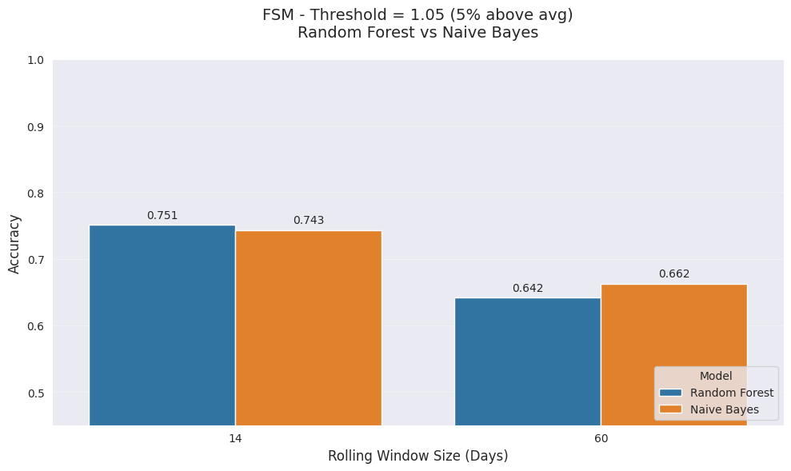
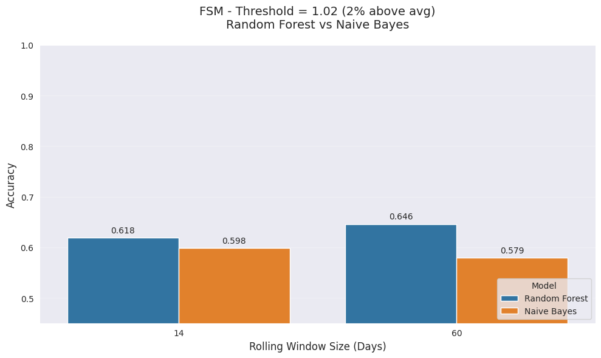
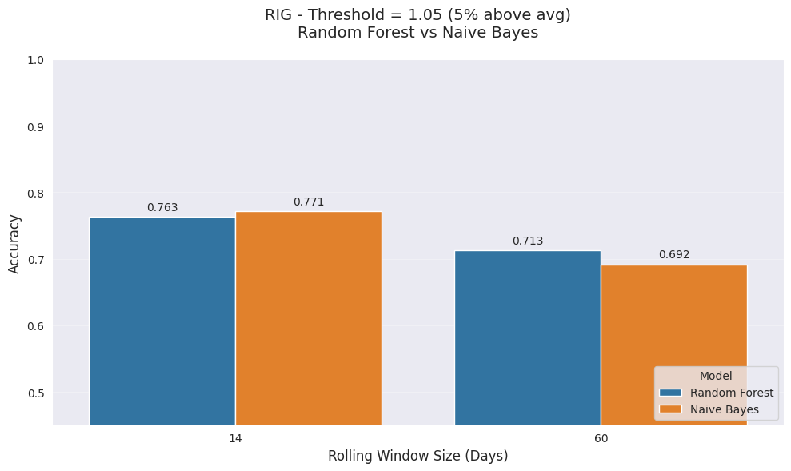
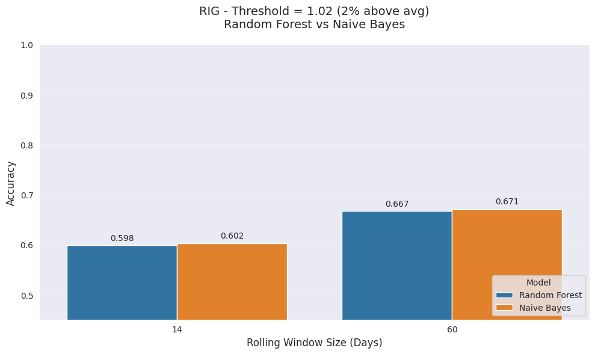

# Stock Price Trend Prediction

**Predicting upward stock trends using skewness and relative volume**  
**FSM vs RIG** — Machine Learning Project


---

## Objective

This project explores whether **two simple engineered features** — skewness of normalized closing prices and relative trading volume — can predict short-term upward price trends in stocks.

We analyze **FSM** and **RIG** using ~5 years of daily data and compare **Random Forest** vs **Gaussian Naive Bayes** across different rolling windows (14-day and 60-day) and trend thresholds (2% and 5%).

---

## Key Results

- The **5% threshold** (last close > 5% above rolling average) produced the **strongest predictive signal**.
- **14-day windows** performed better when targeting stronger (5%) trends.
- **Random Forest and Naive Bayes performed very similarly** — each model outperformed the other in exactly 4 out of 8 scenarios.
- Best overall performance: **5% threshold + 14-day window**.
- **Key Insight**: With only two features, the simpler Naive Bayes model is competitive with the more complex Random Forest.

This highlights an important lesson in applied ML: **more complex ≠ always better**, especially on noisy financial data with limited features.

---

## Visual Results

### FSM Performance



### RIG Performance



*Blue = Random Forest | Orange = Naive Bayes*

---

## Repository Structure

```bash
stock-price-trend-prediction/
├── notebooks/
│   └── stock_price_analysis.ipynb
├── src/
│   └── stock_analysis_02.py
├── data/raw/
│   ├── FSM_daily.pkl
│   └── RIG_daily.pkl
├── reports/
│   └── FULL_MODEL_REPORTS.txt
├── requirements.txt
├── README.md
└── .gitignore
```

---

### **Colab Notebook Link**

## Colab Notebook

[](https://colab.research.google.com/drive/13mDccMvxfU-q6eJRyUqPKNgLm5Y_GNrd?usp=sharing)

---

## Features & Methodology

- **Features Engineered**:
  - Skewness of normalized closing prices in the rolling window
  - Relative trading volume on the last day

- **Experiment Design**:
  - Rolling windows: **14-day** and **60-day**
  - Trend thresholds: **2%** and **5%** above rolling average
  - Models: Random Forest + Gaussian Naive Bayes
  - Evaluation: Accuracy, Precision, Recall, F1-score
 
---

## How to Reproduce

### Prerequisites
- Python 3.8 or higher
- Google Colab (recommended) or Jupyter Notebook

### Steps

1. **Clone the repository**
   ```bash
   git clone https://github.com/d-toups/stock-price-trend-prediction.git
   cd stock-price-trend-prediction

2. **Install dependencies**

    pip install -r requirements.txt

Run the analysisOpen the notebook in Google Colab:
`notebooks/stock_price_trend_analysis.ipynb` (notebooks/stock_price_trend_analysis.ipynb)
Run all cells in order
The notebook will automatically download the stock data if the pickle files are missing

View the resultsSummary table and plots will appear in the notebook
Full detailed classification reports are saved here:
reports/FULL_MODEL_REPORTS.txt

Note: The analysis is fully reproducible (random_state=42). No manual data preparation is required.

---

**How to use it:**
- Delete your current "How to Reproduce" section in the README.
- Paste the block above in its place.

Would you like me to also give you the **entire final README** (all sections combined) in one clean block so you can just replace everything at once?


```

---

## Technologies

- Python, pandas, NumPy, scikit-learn
- Matplotlib / Seaborn, yfinance

---

## Learnings & Reflections

- Stock price prediction is extremely challenging due to market noise and efficiency.
- Feature engineering often matters more than model complexity.
- Simple models can compete with ensembles when the feature set is small.

## Future Improvements

- Add more technical indicators (RSI, ATR, MACD, volatility, etc.)
- Implement proper time-series cross-validation (walk-forward)
- Test XGBoost / LightGBM
- Build and backtest a full trading strategy with risk management
